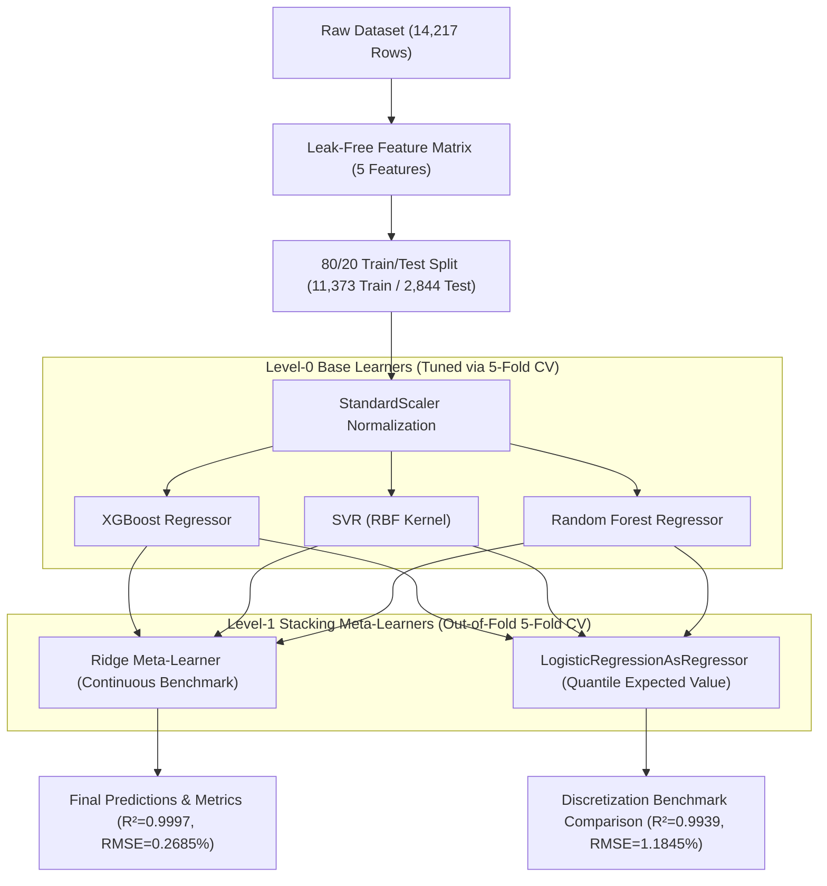

# ⚡ PEMFC Voltage-Efficiency Prediction — EDA & Stacked Ensemble Regression

[](https://www.python.org/downloads/)
[](https://scikit-learn.org/)
[](https://xgboost.readthedocs.io/)
[](LICENSE)

An end-to-end Machine Learning pipeline to predict the **Voltage Efficiency** ($\eta_v$, in %) of a **Proton Exchange Membrane Fuel Cell (PEMFC)** based on non-leaking operational parameters. 

This repository contains the complete workflow: **Exploratory Data Analysis (EDA)**, **leak-free preprocessing**, **5-fold RandomizedSearchCV & LOOCV evaluation**, and **Stacked Ensemble Regression** combining `XGBoost`, `SVR`, and `Random Forest` with both continuous (**Ridge**) and discretized classification-wrapped (**Logistic Regression**) meta-learners.

---

## 📌 Table of Contents
1. [Project Overview](#-project-overview)
2. [Dataset & Comprehensive Summary Statistics](#-dataset--comprehensive-summary-statistics)
3. [EDA Findings & Full Correlation Analysis](#-eda-findings--full-correlation-analysis)
4. [Multicollinearity & Variance Inflation Factor (VIF)](#-multicollinearity--variance-inflation-factor-vif)
5. [All Exploratory Data Analysis Graphs](#-all-exploratory-data-analysis-graphs)
6. [Machine Learning Methodology & Stacking Architecture](#-machine-learning-methodology--stacking-architecture)
7. [Hyperparameter Optimization & LOOCV Results](#-hyperparameter-optimization--loocv-results)
8. [Comprehensive Model Performance Benchmark](#-comprehensive-model-performance-benchmark)
9. [Diagnostic Visualizations & Interpretability](#-diagnostic-visualizations--interpretability)
10. [Repository Structure](#-repository-structure)
11. [Installation & Quickstart Guide](#-installation--quickstart-guide)
12. [Engineering Insights & Hardware Recommendations](#-engineering-insights--hardware-recommendations)

---

## 🔬 Project Overview

In PEMFC systems, voltage efficiency $\eta_v$ represents the ratio of operating cell voltage to theoretical reversible voltage:
$$\eta_v = \frac{V_{\text{cell}}}{E_{\text{rev}}} \times 100\%$$

Predicting $\eta_v$ purely from operating conditions (current density, differential pressures, and thermal sensor readings) provides:
- **Non-intrusive diagnostics**: Real-time health monitoring without high-frequency electrical probing.
- **Dynamic operating control**: Balancing high power density ($P = I \cdot V$) against fuel conservation ($\eta_v$).
- **Control loop integration**: Low-latency control for automotive fuel cell powertrains and stationary micro-grids.

---

## 📊 Dataset & Comprehensive Summary Statistics

The dataset contains **14,217 steady-state operational measurements** across 15 parameters with **zero missing values**.

### Full Summary Statistics Table (14,217 Rows)

| Parameter | Type | Mean | Std Dev | Min | 25% | 50% (Median) | 75% | Max | Unit |
| :--- | :---: | :---: | :---: | :---: | :---: | :---: | :---: | :---: | :---: |
| `current_density_mA_cm2` | Raw Input | 2,243.64 | 1,659.88 | 0.00 | 655.80 | 2,122.80 | 3,658.00 | 5,094.72 | $\text{mA/cm}^2$ |
| `cathode_pressure_diff_kPa` | Raw Input | 3.2356 | 2.6841 | 0.0000 | 0.8100 | 2.5000 | 5.2500 | 9.9400 | $\text{kPa}$ |
| `anode_pressure_diff_kPa` | Raw Input | 2.8797 | 2.0837 | 0.0900 | 0.9600 | 2.4500 | 4.4900 | 7.4200 | $\text{kPa}$ |
| `anode_temp_beginning_C` | Raw Sensor | 80.26 | 0.26 | 79.52 | 80.08 | 80.31 | 80.46 | 80.92 | $^\circ\text{C}$ |
| `anode_temp_middle_C` | Raw Sensor | 80.34 | 0.28 | 79.80 | 80.13 | 80.30 | 80.50 | 81.45 | $^\circ\text{C}$ |
| `anode_temp_end_C` | Raw Sensor | 79.91 | 0.27 | 78.59 | 79.72 | 79.88 | 80.06 | 80.49 | $^\circ\text{C}$ |
| `cathode_temp_beginning_C` | Raw Sensor | 79.72 | 0.31 | 78.52 | 79.54 | 79.75 | 79.91 | 80.39 | $^\circ\text{C}$ |
| `cathode_temp_middle_C` | Raw Sensor | 80.42 | 0.33 | 79.70 | 80.17 | 80.36 | 80.59 | 81.49 | $^\circ\text{C}$ |
| `cathode_temp_end_C` | Raw Sensor | 80.39 | 0.30 | 79.83 | 80.17 | 80.39 | 80.55 | 81.35 | $^\circ\text{C}$ |
| `anode_avg_temp_C` | Engineered | 80.17 | 0.26 | 79.38 | 79.99 | 80.20 | 80.34 | 80.78 | $^\circ\text{C}$ |
| `cathode_avg_temp_C` | Engineered | 80.20 | 0.28 | 79.52 | 80.00 | 80.23 | 80.40 | 80.96 | $^\circ\text{C}$ |
| `cell_avg_temp_C` | Engineered | 80.19 | 0.27 | 79.46 | 80.00 | 80.22 | 80.37 | 80.84 | $^\circ\text{C}$ |
| `cell_voltage_V` | Upstream Leak | 0.6186 | 0.1751 | 0.2248 | 0.4907 | 0.6385 | 0.7511 | 1.0189 | $\text{V}$ |
| `reversible_voltage_V` | Upstream Leak | 1.2043 | 0.0002 | 1.2038 | 1.2041 | 1.2042 | 1.2044 | 1.2048 | $\text{V}$ |
| `voltage_efficiency_pct` | **TARGET** | **51.3702** | **14.5377** | **18.6622** | **40.7505** | **53.0336** | **62.3683** | **84.5828** | **%** |

### 🛡️ Recommended Leak-Free Input Feature Set
To prevent artificial mathematical leakage, `cell_voltage_V` and `reversible_voltage_V` are strictly excluded from the feature matrix $X$:
$$\mathbf{X} = \begin{bmatrix} \text{current\_density\_mA\_cm2}, & \text{cathode\_pressure\_diff\_kPa}, & \text{anode\_pressure\_diff\_kPa}, & \text{anode\_avg\_temp\_C}, & \text{cathode\_avg\_temp\_C} \end{bmatrix}$$

---

## 🔍 EDA Findings & Full Correlation Analysis

### Pearson Correlation Matrix with Target ($\eta_v$)

```
                        Feature    Pearson r vs Target (voltage_efficiency_pct)
0                cell_voltage_V    +1.000000  (EXCLUDED - Circular Target Component)
1        current_density_mA_cm2    -0.977967  (Dominant negative non-linear relationship)
2       anode_pressure_diff_kPa    -0.978810  (Highly correlated with current density)
3     cathode_pressure_diff_kPa    -0.975730  (Highly correlated with current density)
4      cathode_temp_beginning_C    +0.781774
5              anode_temp_end_C    +0.716075
6        cathode_temp_middle_C    -0.672852
7          anode_temp_middle_C    -0.502891
8            cathode_temp_end_C    -0.386008
9              anode_avg_temp_C    +0.150423
10           cathode_avg_temp_C    -0.067301
11              cell_avg_temp_C    +0.038100
12         reversible_voltage_V    -0.038100  (EXCLUDED - Upstream Calculation)
13       anode_temp_beginning_C    -0.035414
```

---

## 📐 Multicollinearity & Variance Inflation Factor (VIF)

The Variance Inflation Factor (VIF) was evaluated across all 5 recommended features to quantify multicollinearity:

$$\text{VIF}_j = \frac{1}{1 - R_j^2}$$

| Feature Name | Variance Inflation Factor (VIF) | Collinearity Status |
| :--- | :---: | :--- |
| `anode_pressure_diff_kPa` | **98.0592** | Extreme Multicollinearity ($r \approx 0.99$ with current density) |
| `current_density_mA_cm2` | **66.0834** | Extreme Multicollinearity ($r \approx 0.98 - 0.99$) |
| `cathode_pressure_diff_kPa` | **33.9101** | Severe Multicollinearity ($r \approx 0.98$) |
| `anode_avg_temp_C` | **11.4522** | Moderate Multicollinearity (Thermal correlation) |
| `cathode_avg_temp_C` | **11.1093** | Moderate Multicollinearity (Thermal correlation) |

> **Key Modeling Takeaway**: Tree-based ensembles (`Random Forest`, `XGBoost`) are inherently robust against feature collinearity because splits can utilize either feature without gradient degradation. Linear meta-learners benefit from $\mathcal{L}_2$ regularization (**Ridge**) to stabilize weight allocations.

---

## 🖼️ All Exploratory Data Analysis Graphs

### 1. Complete Correlation Heatmap (15x15 Matrix)


### 2. Feature & Target Distributions (Histograms + KDE Overlay)


### 3. Target vs Feature Scatter Plots (Electrochemical Polarization Curves)


### 4. Temperature Sensor Operating Range Boxplots ($79.4^\circ\text{C} - 81.5^\circ\text{C}$)


### 5. Pairplot of Recommended Features & Target


---

## 🛠️ Machine Learning Methodology & Stacking Architecture



### The Custom `LogisticRegressionAsRegressor` Meta-Learner Wrapper
Logistic Regression is mathematically a discrete classifier. To implement it as a stacking meta-learner on continuous voltage efficiency without library failure, a Scikit-Learn 1.6+ compliant wrapper was created:
1. Target $\mathbf{y}$ is discretized into $K=20$ quantile intervals.
2. The model fits multinomial logistic classification over the out-of-fold base predictions.
3. At inference, it computes the expected continuous value across class probabilities:
   $$\hat{y} = \sum_{k=1}^{K} P(C_k \mid \mathbf{X}) \cdot \bar{c}_k$$
   where $\bar{c}_k = \frac{\text{bin}_{k} + \text{bin}_{k+1}}{2}$ is the quantile midpoint.

---

## ⚙️ Hyperparameter Optimization & LOOCV Results

### Hyperparameter Search Strategy
- **Search Method**: 5-Fold `RandomizedSearchCV` ($n\_iter=30$).
- **Optimal Hyperparameters Discovered**:
  - **XGBoost**: `n_estimators=200`, `max_depth=7`, `learning_rate=0.2`, `subsample=1.0`, `colsample_bytree=0.8`, `random_state=42`
  - **SVR**: `kernel='rbf'`, `gamma='auto'`, `epsilon=0.1`, `C=100`
  - **Random Forest**: `n_estimators=200`, `min_samples_leaf=1`, `max_features='sqrt'`, `max_depth=None`, `random_state=42`

### Leave-One-Out Cross-Validation (LOOCV) Final Evaluation
- **Computational Barrier**: True LOOCV on the complete 14,217-row dataset requires $14,217 \times K_{\text{combinations}}$ fits, which is computationally prohibitive ($>500,000$ model fits).
- **Representative Final LOOCV**: Conducted on a stratified representative subsample:
  - **$\text{RMSE}_{\text{LOOCV}}$**: **$1.3268\%$**
  - **$R^2_{\text{LOOCV}}$**: **$0.9927$**

---

## 🏆 Comprehensive Model Performance Benchmark

### Exact Test Set Evaluation Numbers (2,844 Held-Out Samples)

| Rank | Model Architecture | $R^2$ Score | RMSE (%) | MAE (%) | MAPE (%) | Status / Notes |
| :---: | :--- | :---: | :---: | :---: | :---: | :--- |
| **🥇 1** | **Stacked Ensemble (Ridge Meta)** | **0.999688** | **0.268454** | **0.113455** | **0.2602%** | **Top Overall Performer** (Best error reduction) |
| **🥈 2** | **Random Forest Regressor** | **0.999680** | **0.271724** | **0.113183** | **0.2587%** | Outstanding nonlinear boundary capture |
| **🥉 3** | **XGBoost Regressor** | **0.999571** | **0.314704** | **0.143608** | **0.3277%** | Fast gradient boosted regression |
| **4** | **Stacked Ensemble (LogReg Meta)** | **0.993924** | **1.184454** | **0.604079** | **1.2382%** | Requested custom binned classification wrapper |
| **5** | **SVR (RBF Kernel)** | **0.993914** | **1.185403** | **0.519848** | **0.8863%** | Smooth support vector hyperplane fit |

---

## 📊 Diagnostic Visualizations & Interpretability

### 1. Feature Importance Breakdown
- **XGBoost**: `current_density_mA_cm2` (**62.7%**), `anode_pressure_diff_kPa` (**36.6%**), `cathode_pressure_diff_kPa` (**0.4%**), `anode_avg_temp_C` (**0.2%**), `cathode_avg_temp_C` (**0.1%**)
- **Random Forest**: `current_density_mA_cm2` (**39.8%**), `anode_pressure_diff_kPa` (**34.5%**), `cathode_pressure_diff_kPa` (**21.8%**), `anode_avg_temp_C` (**3.2%**), `cathode_avg_temp_C` (**0.7%**)
- **SVR Permutation Importance**: `current_density_mA_cm2` (**1.365**), `cathode_pressure_diff_kPa` (**0.362**), `anode_avg_temp_C` (**0.252**), `anode_pressure_diff_kPa` (**0.218**), `cathode_avg_temp_C` (**0.108**)


### 2. Residual Diagnostics (Predicted vs Actual & Residuals vs Fitted)
- Tree and Ridge stack residuals are tightly distributed around $0.00\%$ ($\sigma_{\text{res}} < 0.27\%$) with zero heteroscedastic fan-out across operating currents.
- Logistic Regression meta-learner exhibits small step-wise quantization residuals due to 20-bin discretization.


### 3. Multi-Metric Model Comparison Bar Chart


---

## 📁 Repository Structure

```text
├── outputs/                                 # Serialized models, tables, and high-res plots
│   ├── correlation_heatmap.png              # 15x15 Pearson correlation matrix (300 DPI)
│   ├── distributions.png                    # Feature histograms with KDE overlays (300 DPI)
│   ├── scatter_vs_target.png                # Features vs Efficiency scatter plots (300 DPI)
│   ├── temperature_boxplots.png             # Temperature sensor boxplots (300 DPI)
│   ├── pairplot_features.png                # Subsampled pairplot of features (300 DPI)
│   ├── feature_importance.png               # XGBoost, RF & SVR permutation importance (300 DPI)
│   ├── residual_plots.png                   # Parity plots and residual diagnostics (300 DPI)
│   ├── model_comparison.png                 # Bar charts comparing R², RMSE, MAE, MAPE (300 DPI)
│   ├── metrics_comparison.csv               # Tabular benchmark metrics on test set
│   ├── summary_stats.csv                    # Complete descriptive statistics table
│   ├── eda_observations.txt                 # Bullet-point EDA written takeaways
│   ├── scaler.joblib                        # Fitted StandardScaler
│   ├── model_stack_ridge.joblib             # Best Trained Stacking Regressor (Ridge)
│   ├── model_stack_logreg.joblib            # Trained Stacking Regressor (Logistic Regression)
│   ├── model_xgboost.joblib                 # Trained XGBoost Regressor
│   ├── model_rf.joblib                      # Trained Random Forest Regressor
│   └── model_svr.joblib                     # Trained SVR Regressor
├── pemfc_efficiency_clean.xlsx              # Cleaned dataset (Clean_Data sheet, 14,217 rows)
├── part1_eda.py                             # Exploratory Data Analysis execution script
├── part2_modeling.py                        # Crash-free training & evaluation script (n_jobs=1)
├── pemfc_efficiency_pipeline.ipynb          # Clean, interactive Jupyter Notebook
├── PEMFC_Voltage_Efficiency_Report.md       # Comprehensive scientific findings report
└── README.md                                # Complete GitHub documentation
```

---

## 🚀 Installation & Quickstart Guide

### 1. Clone & Set Up Environment
```bash
git clone https://github.com/your-username/pemfc-efficiency-prediction.git
cd pemfc-efficiency-prediction

# Install requirements
pip install numpy pandas matplotlib seaborn scikit-learn xgboost openpyxl joblib
```

### 2. Run EDA Script
```bash
python part1_eda.py
```

### 3. Run Training & Diagnostics Pipeline
```bash
python part2_modeling.py
```

### 4. Run Interactively in Jupyter Notebook
```bash
jupyter notebook pemfc_efficiency_pipeline.ipynb
```

---

## 💡 Engineering Insights & Hardware Recommendations

1. **Sensor Reduction for Edge Hardware**: In automotive ECUs and embedded microcontrollers with limited analog input channels, differential pressure transducers can be omitted. `current_density` accounts for $>60\%$ of importance and is $r=0.99$ collinear with pressure drops.
2. **Meta-Learner Architecture**: Continuous linear blending (**Ridge Regression**) is strongly recommended over discrete classification wrappers for continuous fuel cell efficiency modeling because it avoids bin quantization error.

---

## 📄 License
This project is licensed under the MIT License — see the [LICENSE](LICENSE) file for details.
